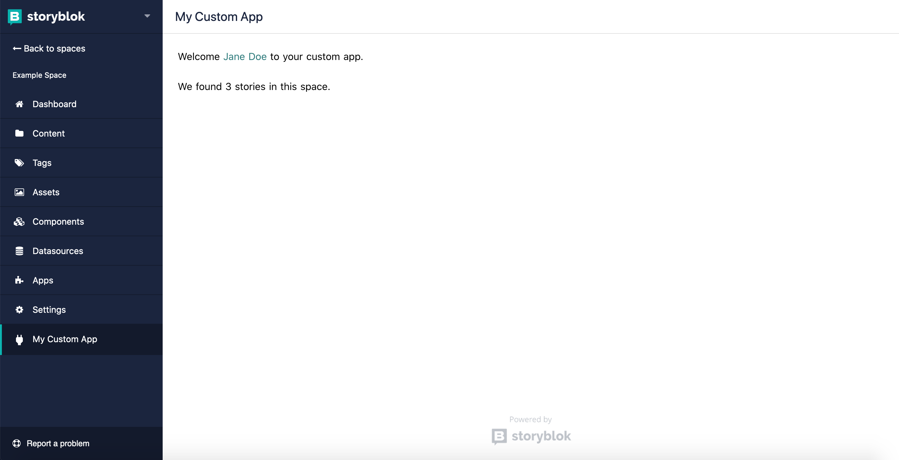

<p align="center">
  <h1 align="center">Storyblok Serverless Custom App with Netlify  </h1>
</p>



> Example App to start with in Storyblok.

Based on our [Workflow App](https://github.com/storyblok/storyblok-workflow-app)


## Tutorial

This repository is the end result of following our [How to Build a Serverless Custom App with Storyblok, Grant and Supabase](https://www.storyblok.com/tp/serverless-custom-app-oauth-2) tutorial. 


Firstly, to create an app on Storyblok, you need to enter to the [our partner program](https://www.storyblok.com/partners).

### Installation

``` bash
# clone this repository
$ git clone https://github.com/storyblok/serverless-custom-app-starter.git

# Enter the directory
$ cd serverless-custom-app-starter

# install dependencies
$ npm install
```

### Environment Variables

To run the project you will need to set up a few serverless functions on [netlify](https://netlify.app/).

Rename the file `.env-example` to `.env` and fill out the variables.

~~~text
STORYBLOK_CLIENT_ID=Q...==
STORYBLOK_CLIENT_SECRET=MJ...Q==
STORYBLOK_CLIENT_REDIRECT_URI=https://vercel-dashboard.lisilinhart.vercel.app/connect/storyblok/callback
SUPABASE_DB_URL=https://ig...di.supabase.co
SUPABASE_PUBLIC_KEY=eyJ...Uk
~~~


### Deploy

This app is like any other Nuxt app, so, the deploy is the same ([check the Nuxt documentation about this](https://nuxtjs.org/guide/commands#production-deployment)). Since the tutorial makes use of serverless functions on Vercel, we recommend deploying it to [Vercel](https://vercel.com/) with the following command:

```
$ npm run build
$ npm run generate
$ vercel
```

The functions in the `api` folder will automatically be deployed as serverless functions. Make sure to set all environment variables in the `.env-example` in Netlify as well. 

---

<p align="center">
  <h5 align="center">Powered by <a href="https://www.storyblok.com/" title="link to the Storyblok website">Storyblok</a></h5>
</p>
